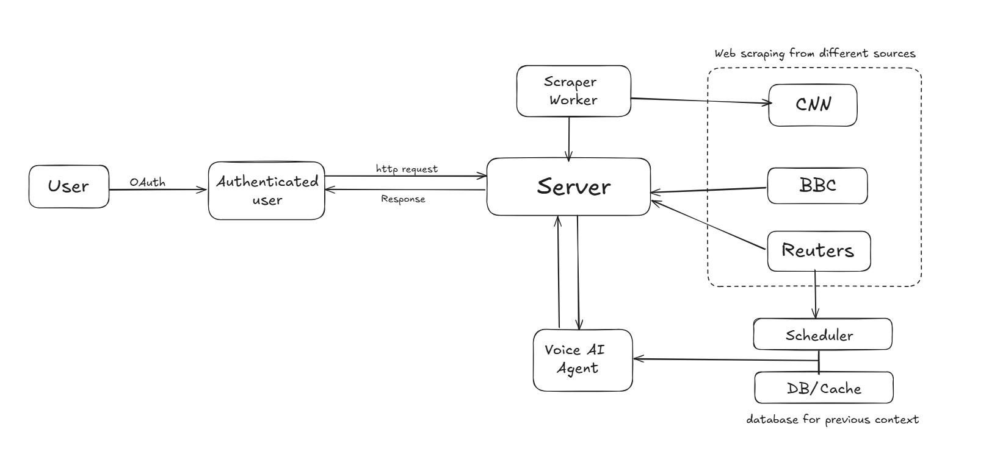
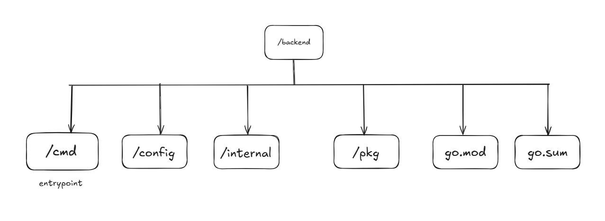

# AgentReport

## Introduction

AgentReport is an AI-powered news aggregation and summarization tool designed to simplify your daily news consumption. It addresses the challenge of information overload and the need for cross-verification of news sources by providing a single, reliable platform for current events.

AgentReport scrapes major news outlets like [CNN](https://edition.cnn.com/) and the [BBC](https://www.bbc.com/) to gather news articles. It then utilizes an AI voice agent, powered by [Vapi](https://vapi.ai), to answer your questions about current affairs, provide news summaries, and retrieve information from previous dates.

 

## System Design

Agent Report follows a workflow that is similar to the one given below:

 

## Backend Structure

The backend is responsible for Scraping the data from the sites. It exposes an API endpoint which is used by the frontend to send requests by the user and give feedback via Vapi agent. The backend is written entirely in Go.

Average time taken to scrape the websites without goroutines: `2s`
Average time taken to scrape the websites with goroutines: `1s`

